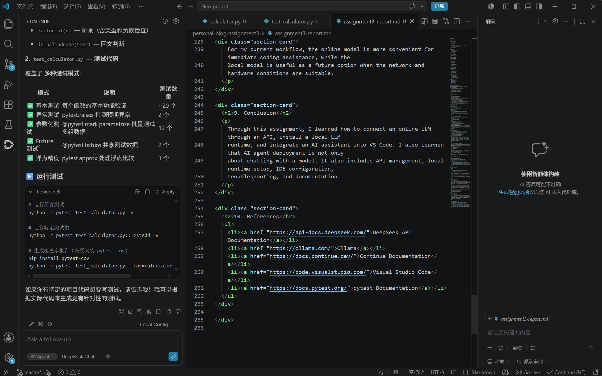

<h1>Assignment 3: Deployment and Integration of AI Agents</h1>

  
<strong>Student Name:</strong> WuYuekai

  
<strong>Student ID:</strong> ZY2557209

  

    DeepSeek API
    Ollama
    VS Code
    Continue
    AI Agent
  

  <h2>1. Project Overview</h2>
  

    The objective of this assignment is to deploy and compare online and local large language models,
    integrate an LLM into a development environment, and document the complete process. I used
    DeepSeek as the online model provider, Ollama for local model deployment, and the Continue
    extension in VS Code for IDE integration.
  

  
The main goals of this assignment are:

  <ul>
    <li>Use an online LLM API to complete an agent-style task.</li>
    <li>Install Ollama and prepare a local model environment.</li>
    <li>Integrate an LLM into VS Code.</li>
    <li>Use the AI assistant to explain or improve code.</li>
    <li>Compare online and local models based on setup, performance, and usefulness.</li>
  </ul>

  <h2>2. Tools and Environment</h2>
  <table>
    <tr><th>Tool</th><th>Purpose</th></tr>
    <tr><td>DeepSeek API</td><td>Online LLM provider for chat and code assistance</td></tr>
    <tr><td>Python</td><td>Simple API test script and calculator example</td></tr>
    <tr><td>Ollama</td><td>Local LLM runtime</td></tr>
    <tr><td>VS Code</td><td>Development environment</td></tr>
    <tr><td>Continue</td><td>VS Code extension for LLM coding assistance</td></tr>
    <tr><td>pytest</td><td>Testing framework for the calculator example</td></tr>
  </table>

  <h2>3. Online Agent with DeepSeek</h2>
  

    I obtained a DeepSeek API key and tested the online model with a short request. For security,
    the real API key is not included in this report or in the source code. The Python script reads
    the key from an environment variable named <code>DEEPSEEK_API_KEY</code>.
  

  
The model used in this part was:

  <pre><code>deepseek-chat</code></pre>
  
I first sent a simple test prompt:

  <pre><code>Reply with exactly: DeepSeek OK</code></pre>
  
The API returned:

  <pre><code>DeepSeek OK</code></pre>
  

    After confirming the API connection, I used the model as an online coding assistant. It helped
    explain a pytest file and suggested commands for running the tests. This shows that the online
    agent can analyze project files and provide useful development suggestions.
  

  

    
    

      Figure 1. DeepSeek Chat was connected in the Continue extension and used to analyze the pytest file.
    

  

  <h2>4. Local Model Deployment with Ollama</h2>
  
I installed Ollama on Windows from the official website:

  <pre><code>https://ollama.com/download/windows</code></pre>
  
After installation, I verified the version:

  <pre><code>ollama --version</code></pre>
  
The installed version was:

  <pre><code>ollama version is 0.24.0</code></pre>
  
I planned to pull a Qwen local model using:

  <pre><code>ollama pull qwen2.5:0.5b
ollama run qwen2.5:0.5b</code></pre>
  

    During the model download step, the local Ollama service worked, but the connection to the Ollama
    model registry timed out. The error message showed an <code>i/o timeout</code> when accessing
    <code>registry.ollama.ai</code>. This means the installation was successful, but the model download
    depended on network stability.
  

  <h2>5. IDE Integration with Continue</h2>
  

    I installed the Continue extension in VS Code and configured it to use DeepSeek Chat. I also added
    an Ollama local model entry so that VS Code can use a local model after the model is downloaded.
  

  
The configured model entries were:

  <ul>
    <li>DeepSeek Chat</li>
    <li>Ollama Local Autodetect</li>
  </ul>
  

    I opened <code>test_calculator.py</code> in VS Code and asked the AI assistant to explain the test file.
    The assistant recognized that the file used pytest and explained the tests for addition, subtraction,
    multiplication, division, factorial, and palindrome checking.
  

  
It also suggested a command for running the tests:

  <pre><code>python -m pytest test_calculator.py -v</code></pre>
  

    
    

      Figure 2. VS Code IDE integration with Continue. The assistant explained the test code and suggested pytest commands.
    

  

  <h2>6. Code Example Used for IDE Testing</h2>
  

    To test the IDE assistant, I used a small calculator module and a pytest file. The calculator module
    contains basic functions such as <code>add</code>, <code>subtract</code>, <code>multiply</code>, <code>divide</code>,
    <code>factorial</code>, and <code>is_palindrome</code>.
  

  
Related files:

  <ul>
    <li><a href="assignment3/deepseek_agent.py">DeepSeek API Test Script</a></li>
    <li><a href="assignment3/calculator.py">Calculator Source Code</a></li>
    <li><a href="assignment3/test_calculator.py">Calculator Test Code</a></li>
  </ul>

  <h2>7. Problems and Solutions</h2>
  <table>
    <tr><th>Problem</th><th>Solution</th></tr>
    <tr>
      <td>API key should not be exposed in public files.</td>
      <td>I used an environment variable and did not put the real key in the report or source code.</td>
    </tr>
    <tr>
      <td>Ollama model download timed out.</td>
      <td>I verified that Ollama was installed correctly and planned to retry the model pull with a more stable network.</td>
    </tr>
    <tr>
      <td>VS Code needed model configuration before use.</td>
      <td>I installed Continue and configured DeepSeek Chat and Ollama model entries.</td>
    </tr>
  </table>

  <h2>8. Reflection</h2>
  

    The online model was easier to use after the API key was configured. DeepSeek responded quickly and
    was useful for explaining code and generating test commands. It was especially convenient inside VS Code
    because it did not require downloading a large model file.
  

  

    The local model setup required more work. Ollama itself was easy to install, but downloading a model
    depended on network stability and local computer resources. The advantage of a local model is that it can
    run on my own computer after download, which is better for privacy and offline use.
  

  

    For my current workflow, the online model is more convenient for immediate coding assistance, while the
    local model is useful as a future option when the network and hardware conditions are suitable.
  

  <h2>9. Conclusion</h2>
  

    Through this assignment, I learned how to connect an online LLM through an API, install a local LLM
    runtime, and integrate an AI assistant into VS Code. I also learned that AI agent deployment is not only
    about chatting with a model. It also includes API management, local runtime setup, IDE configuration,
    troubleshooting, and documentation.
  

  <h2>10. References</h2>
  <ul>
    <li><a href="https://api-docs.deepseek.com/">DeepSeek API Documentation</a></li>
    <li><a href="https://ollama.com/">Ollama</a></li>
    <li><a href="https://docs.continue.dev/">Continue Documentation</a></li>
    <li><a href="https://code.visualstudio.com/">Visual Studio Code</a></li>
    <li><a href="https://docs.pytest.org/">pytest Documentation</a></li>
  </ul>

